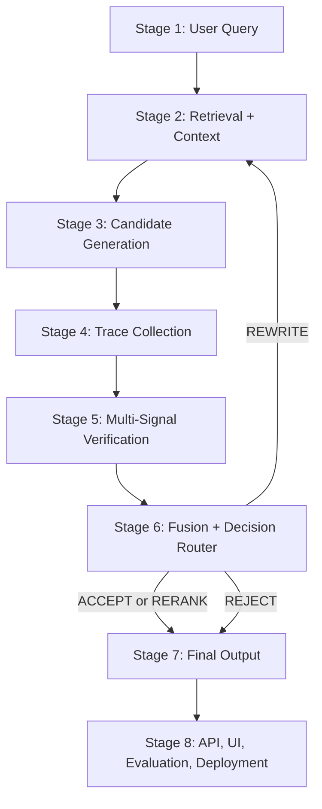

# SafeResponse Engine

SafeResponse Engine is an LLM safety middleware prototype. By default it wraps
retrieval, candidate generation, trace collection, verification, routing, and
final response formatting around a pretrained instruction model so unsupported
answers can be rejected before they reach the user. It also includes an optional
LoRA fine-tuning workflow for improving the generation style on grounded
question-answer examples.

## Pipeline



Implemented stages:

| Stage | Status | Main Files |
|---|---|---|
| 1. User Query | Implemented | `components/user_query.py`, `pipeline/stage_01_user_query.py` |
| 2. Retrieval | Implemented | `components/retrieval_layer.py`, `pipeline/stage_02_retrieval_layer.py` |
| 3. Generation | Implemented | `components/generation_layer.py`, `pipeline/stage_03_generation_layer.py` |
| 4. Trace Collection | Implemented | `components/trace_collection_layer.py`, `pipeline/stage_04_trace_collection_layer.py` |
| 5. Verification | Implemented, needs calibration | `components/verification_layer.py`, `pipeline/stage_05_verification_layer.py` |
| 6. Fusion Router | Implemented | `components/fusion_decision_router.py`, `pipeline/stage_06_fusion_decision_router.py` |
| 7. Final Output | Implemented | `components/final_output.py`, `pipeline/stage_07_final_output.py` |
| 8. API/UI/Evaluation | Implemented for demo | `serving/api.py`, `templates/index.html`, `scripts/run_evaluation.py` |

## Setup

Use the project virtual environment. **Python 3.12 is required** (newer interpreters such as
3.14 do not yet have torch/faiss wheels). On Apple Silicon the model runs on the MPS backend.

```bash
python3.12 -m venv venv
venv/bin/python -m pip install --upgrade pip
venv/bin/python -m pip install -r requirements.txt
```

Model weights load **offline by default**. For the first run, allow downloads with
`SAFE_RESPONSE_ALLOW_MODEL_DOWNLOADS=1` (Qwen2.5-1.5B-Instruct ≈ 3 GB, `BAAI/bge-small-en-v1.5`
≈ 130 MB).

Run tests:

```bash
venv/bin/python -m pytest
```

Run the full local pipeline:

```bash
venv/bin/python main.py
```

Run the API and UI:

```bash
venv/bin/uvicorn app:app --host 127.0.0.1 --port 8000
```

Open:

```text
http://127.0.0.1:8000
```

## Fine-Tuning

The generation model is `Qwen/Qwen2.5-1.5B-Instruct`. Fine-tuning is optional and uses
a small LoRA adapter instead of rewriting the whole base model.

Validate the configured training file:

```bash
venv/bin/python scripts/finetune_model.py --dry-run
```

Download and convert SQuAD v2 for grounded fine-tuning:

```bash
venv/bin/python scripts/prepare_squad_v2.py --update-config
```

By default this creates a balanced local training file with 20,000 records:
10,000 answerable examples and 10,000 unanswerable examples. The raw Parquet
files and converted SQuAD data are stored under `data/squad_v2/` and can be
regenerated.

Run LoRA fine-tuning:

```bash
SAFE_RESPONSE_ALLOW_MODEL_DOWNLOADS=1 \
venv/bin/python scripts/finetune_model.py
```

Small local smoke run:

```bash
SAFE_RESPONSE_ALLOW_MODEL_DOWNLOADS=1 \
venv/bin/python scripts/finetune_model.py \
  --run-name smoke \
  --max-records 16 \
  --max-steps 1 \
  --output-dir models/saferesponse-qwen-lora-smoke
```

The script writes the adapter to `models/saferesponse-qwen-lora`. To use it in
the app, set both fields in `config/config.yaml`:

```yaml
generation_layer:
  finetuned_model_path: models/saferesponse-qwen-lora

trace_collection_layer:
  finetuned_model_path: models/saferesponse-qwen-lora
```

SQuAD v2 is a strong starting point for grounded answers and abstentions. Add
project-specific examples before expecting domain-specific quality improvements.
Training run metadata is written beside the adapter and appended to
`model_registry/registry.json`.

Docker installs `requirements-docker.txt` plus a CPU PyTorch wheel so the API/UI
image can run the same model-backed pipeline that the browser UI calls without
pulling CUDA libraries into a CPU image. By default model loading is
offline-only; pre-populate the Hugging Face cache or set
`SAFE_RESPONSE_ALLOW_MODEL_DOWNLOADS=1` for first-run downloads. The Docker
image defaults CPU model loading to `SAFE_RESPONSE_CPU_DTYPE=float16` to reduce
memory pressure; use `float32` if you have more memory and want the default CPU
precision. Full Qwen CPU generation needs more than the 4 GB Docker Desktop VM
limit used during local testing; allocate 8 GB or use a GPU image for production
model-backed generation.

## API

Main endpoints:

```text
GET  /health
GET  /metrics
GET  /v1/final-response
POST /v1/query
POST /v1/query/jobs
GET  /v1/query/jobs/{job_id}
POST /v1/chat
POST /v1/chat/jobs
GET  /v1/chat/jobs/{job_id}
GET  /v1/conversations
GET  /v1/conversations/{conversation_id}
```

Production controls:

```bash
SAFE_RESPONSE_API_KEY=replace-me
SAFE_RESPONSE_ALLOWED_ORIGINS=https://your-domain.com
SAFE_RESPONSE_RATE_LIMIT_PER_MINUTE=60
SAFE_RESPONSE_STATE_DB=artifacts/api_state.sqlite3
SAFE_RESPONSE_CONVERSATION_STORE=artifacts/conversation_memory/conversations.json
SAFE_RESPONSE_CPU_DTYPE=float16
```

When `SAFE_RESPONSE_API_KEY` is set, send `X-API-Key` on every non-public API
request. `/` and `/health` remain public.

Example:

```bash
curl -X POST http://127.0.0.1:8000/v1/chat \
  -H "Content-Type: application/json" \
  -d '{"message":"hi","run_pipeline":false}'
```

## Evaluation

Full evaluation examples, including retrieval/generation runs:

```bash
venv/bin/python scripts/run_evaluation.py
```

Fast smoke evaluation without model-heavy examples:

```bash
venv/bin/python scripts/run_evaluation.py --skip-model-runs
```

The evaluation set is stored in `evaluation/examples.json`. It includes
supported corpus questions, unsupported entity-overlap questions, current-fact
questions, and stale-fact traps such as live president/weather/market queries.

## Docker

Local Docker verification:

```bash
docker build -t saferesponse-engine:local .
docker run --rm -p 8000:8000 \
  -e SAFE_RESPONSE_ALLOW_MODEL_DOWNLOADS=1 \
  -v saferesponse-artifacts:/app/artifacts \
  -v saferesponse-hf-cache:/app/.cache/huggingface \
  saferesponse-engine:local
```

EC2/AWS deployment is intentionally not part of the active project setup. The
current repository is focused on local development, Docker packaging, and a
reproducible demo path.

## Controlled Corpus

The default config uses a curated, controlled Wikipedia corpus (44 articles across history,
science, geography, technology, sports, and the arts) with **dense FAISS retrieval**:

```yaml
retrieval_layer:
  num_articles: 44
  retrieval_backend: dense
  embedding_model: BAAI/bge-small-en-v1.5
  min_score_threshold: 0.65
```

The corpus lives in `data/demo_corpus.json` and is committed for offline reproducibility;
regenerate it with `venv/bin/python scripts/build_demo_corpus.py`. Questions supported by the
corpus are answered with a source and confidence; questions outside it are rejected quickly
without running generation when no sufficiently grounded chunks are found.

## Ablation / Research Results

The core research question — *does the verification layer actually reduce hallucinations?* — is
measured by an ablation that runs the evaluation set with verification fully OFF, fully ON, and
each signal in isolation, reporting false-accept rate (FAR), false-reject rate (FRR), and
accuracy:

```bash
SAFE_RESPONSE_ALLOW_MODEL_DOWNLOADS=1 venv/bin/python scripts/run_ablation.py
```

Results are written to `artifacts/ablation-report.json` (a committed copy lives at
`docs/ablation-report.json`). The engine is **safe-by-default / fail-closed**: the grounding
signal establishes the supporting source required to accept, so disabling verification does not
make the system permissive — it makes it reject. With all signals on and calibrated, grounded
in-corpus answers are accepted while every out-of-corpus query is rejected (FAR = 0).

## Web UI

The browser UI (`/`) is verdict-first: every answer shows the decision (ACCEPT / REVIEW /
REJECT), a confidence meter, the source citation, a per-signal risk breakdown, and live
8-stage pipeline progress while a query runs. It supports light and dark themes.

## Limitations

- This is a safety middleware prototype, not a production hallucination detector.
- The retrieval corpus is intentionally controlled (44 curated articles).
- Verification thresholds are calibrated on a small evaluation set; broader calibration is future work.
- Logprob, grounding, and consistency are the core demo signals.
- NTK, Jacobian, and spectral conditioning code paths are experimental unless
  they are enabled, benchmarked, and documented for a specific run.
- Model-heavy stages require local Hugging Face model availability or network
  access for first-time downloads.

## More Documentation

- Completion plan: `docs/project_completion_plan.md`
- Demo guide: `docs/demo_guide.md`
- API reference: `docs/api_reference.md`
- Evaluation guide: `docs/evaluation.md`
- Verification strategy: `docs/verification_strategy.md`
- Deployment runbook: `docs/deployment_runbook.md`
- Stage 6 design: `docs/stage6_documentation.md`
